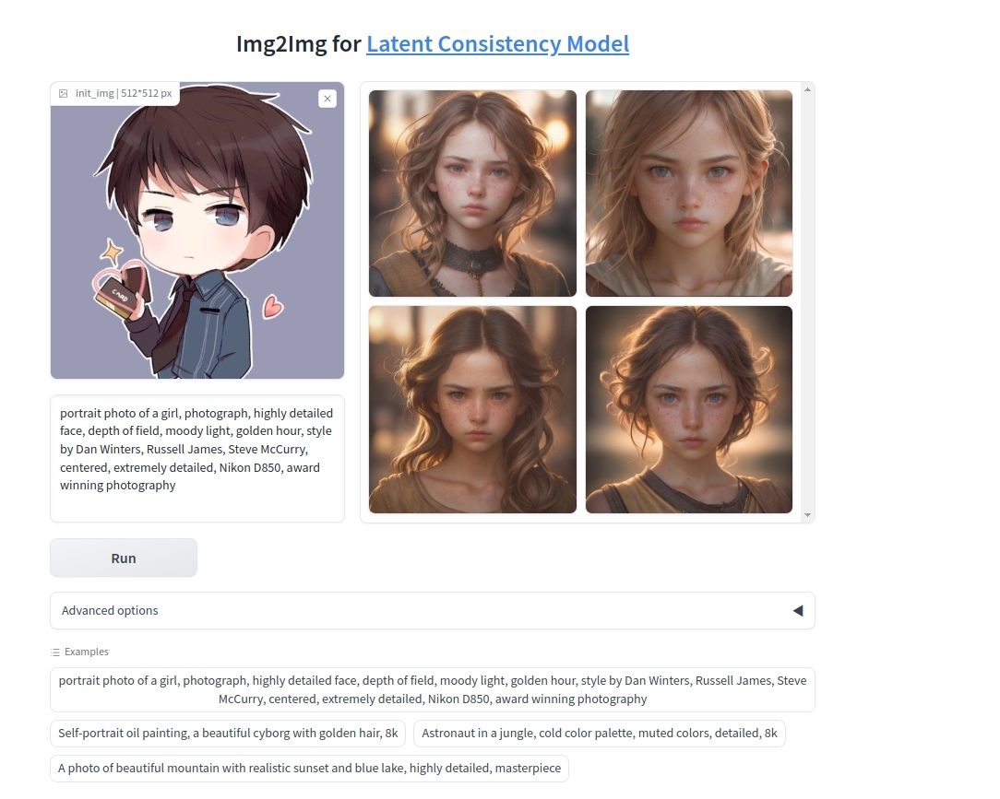

# latent-consistency-model
# how to deploy
1. get weight and extract
```bash
mkdir model_cache
cd model_cache
wget https://weights.replicate.delivery/default/fofr-lcm/model_cache.tar
tar -xvf model_cache.tar
cd ..
```
2. install pytorch 2.1.0, need python==3.10.x
3. install other python requirements
```bash
pip install -r requirements.txt
```
4. run api.py
```bash
python3 api.py
```

5. run gradio web (Option)
```bash
python img2img_app.py
```

6. client (Option)
```bash
python3 client.py
```


# Example

